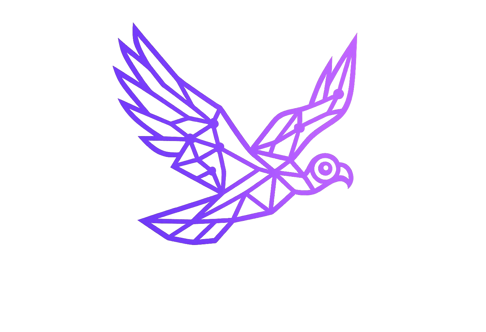
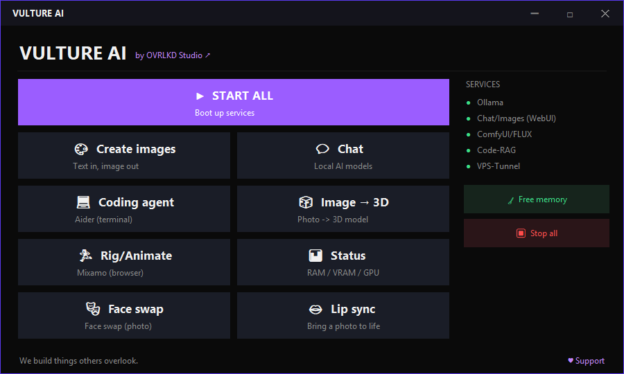
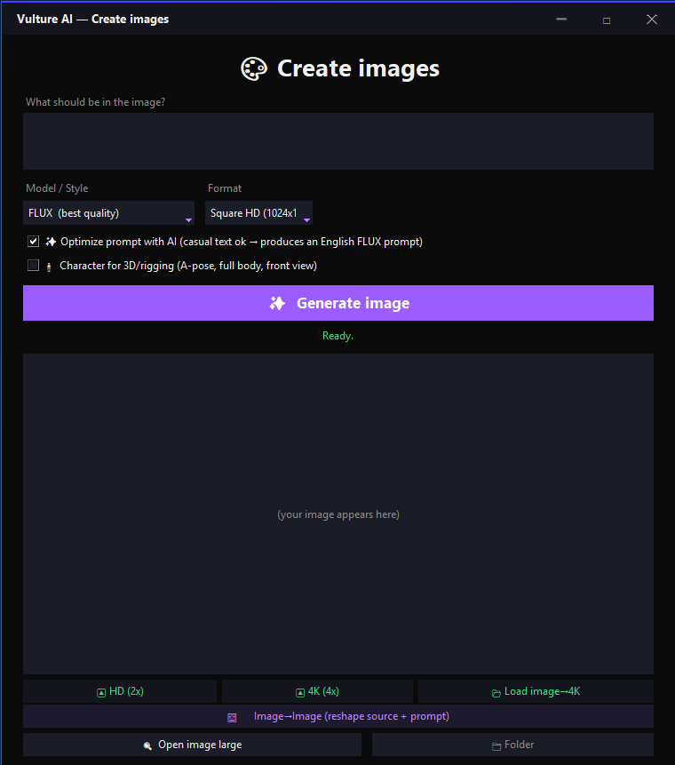
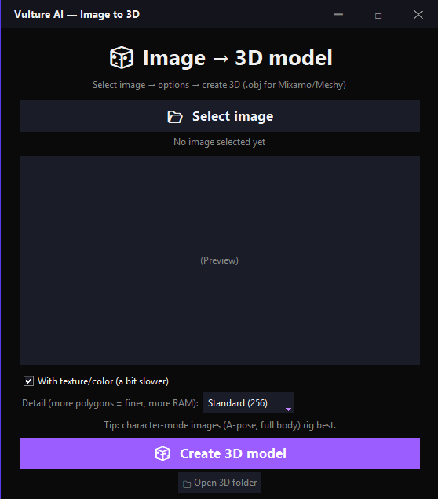
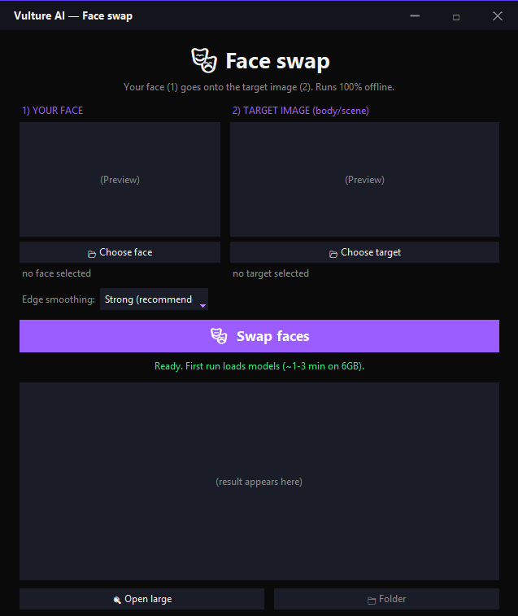
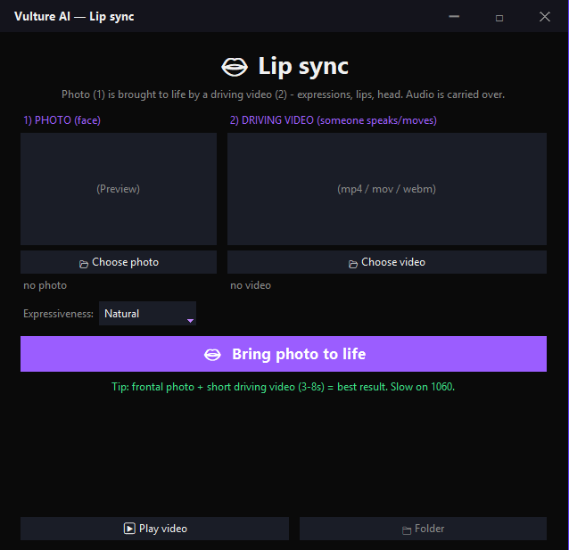
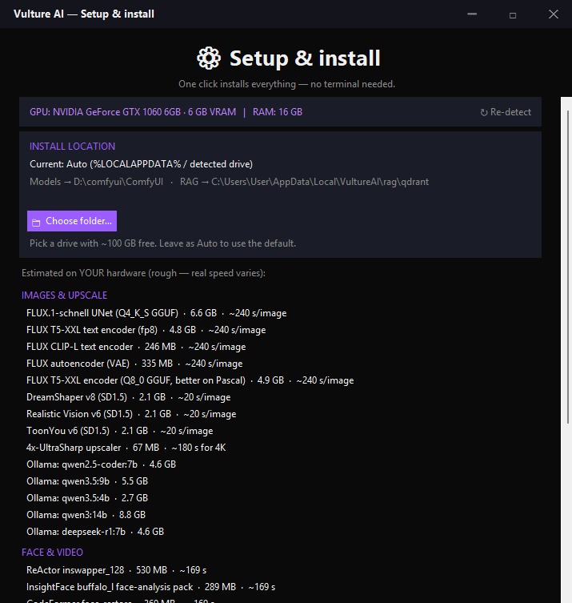

  

# 🦅 Vulture AI

### by Overlkd Studio

**A fully offline, private AI creative studio in one clean desktop app.**
No cloud, no API keys, no subscriptions — nothing leaves your machine.

*Named after the vulture: it soars high above and sees everything — yet stays entirely on your machine.*

> ⚠️ **Early / work-in-progress.** It currently runs on the author's setup and
> hasn't been widely tested on other machines yet. Cross-machine setup is the
> first thing being worked on — contributions welcome!

---

## What it is

Every individual AI tool out there is brilliant — but you spend more time gluing
them together than actually using them. Overlkd Studio wraps them into **one
window** so non-technical people can use them too. No ComfyUI node spaghetti,
no terminal.

## Features (all local / offline)

- 🎨 **Image generation** — FLUX (GGUF) + several SD1.5 models, with a built-in
  **prompt optimizer** (a local LLM turns your casual text into a proper prompt)
- 🔍 **4K upscaling** — 4x-UltraSharp + tiled Ultimate SD Upscale (real detail)
- 🖼️ **img2img** reworking
- 🧊 **Image → 3D** (TripoSR / Hunyuan3D) → `.obj`
- 🎭 **Face-swap** (ReActor) and 👄 **lip-sync / talking photos** (LivePortrait)
- 💬 **Local chat** — Ollama (Qwen, DeepSeek-R1, vision models) + Open WebUI
- 💻 **Local coding agent** — Aider + local models, with an auto test→repair loop
  and an **auto-splitter** that breaks a big prompt into small steps so weaker
  local models don't choke
- 🧠 **Two local RAGs, one embedded store** — **Code-RAG** searches **your own**
  projects by meaning (pick a folder or clone a public GitHub repo), and
  **Chat-RAG** keeps chat memory across sessions. Both live in the same embedded
  local RAG (Qdrant + local embeddings), reachable from the **Code search**
  window — 100% local, nothing on any server, nothing leaves your machine.
  (Auto-filling chat memory from the chat UI is an optional integration.)
- ⚙️ Context size **auto-scales** to your GPU — zero manual tuning

## A look inside

<table>
  <tr>
    <td width="50%"> <b>Create images</b> — FLUX + prompt optimizer, HD / 4K upscale, img2img</td>
    <td width="50%"> <b>Image → 3D</b> — a photo becomes a textured 3D model</td>
  </tr>
  <tr>
    <td> <b>Face swap</b> — your face onto any target, fully offline</td>
    <td> <b>Lip sync</b> — a photo brought to life by a driving video</td>
  </tr>
  <tr>
    <td> <b>Setup &amp; install</b> — hardware check, per-GPU speed estimates, one-click install</td>
    <td></td>
  </tr>
</table>

## Runs on modest hardware

Most of this runs on a **GTX 1060 6GB**. It's slow on old cards, but it *works*.
More VRAM = much faster. A wave of RTX-era additions (local video, text-to-music,
voice cloning, LoRA training) is prepared in [`rtx-setup/`](rtx-setup/).

## Models are NOT included

This repo is just the **launcher, UI and setup scripts**. The AI models
(tens of GB, and some under non-commercial licenses) are **downloaded on your
machine** from their original sources during setup. See [`rtx-setup/`](rtx-setup/)
for the install waves.

## Requirements (rough)

- Windows, Python 3.11, an NVIDIA GPU (6GB+; 12GB recommended)
- Ollama installed; ComfyUI (the studio can start it)
- ~100GB free disk for models (put them on a big drive!)

## Status & roadmap

- ✅ Working: image gen + optimizer, 4K upscale, img2img, image→3D, face-swap,
  lip-sync, local chat, coding agent + auto-splitter, Code-RAG + Chat-RAG (both local)
- 🔜 Next: local **video** (LTX-2 / Wan 2.2), **text-to-music**, **voice cloning** (TTS),
  local **LoRA training**, cross-machine installer

> ⚙️ **Heads up:** the next wave (video, voice, LoRA training) needs more VRAM than a
> GTX 1060 — realistically a 12GB+ GPU. Development is currently bottlenecked by hardware.

## Support

Vulture AI is free and always will be. A ⭐ on GitHub helps a ton. 🙏

## License

[MIT](LICENSE) — free to use, modify and share. Please keep the credit.
Vulture AI only licenses **its own launcher/UI code**; the bundled tools and
models each have their own licenses (some non-commercial). See [NOTICE](NOTICE).

## Credits

Built on the shoulders of ComfyUI, Ollama, Open WebUI, Aider, FLUX, Stable
Diffusion, ReActor, LivePortrait, TripoSR/Hunyuan3D, Qdrant and many more.
Full list in [NOTICE](NOTICE). 🙏
